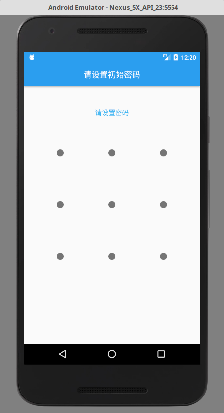
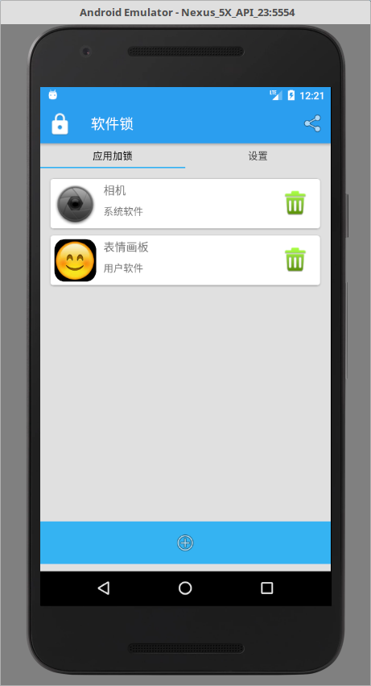
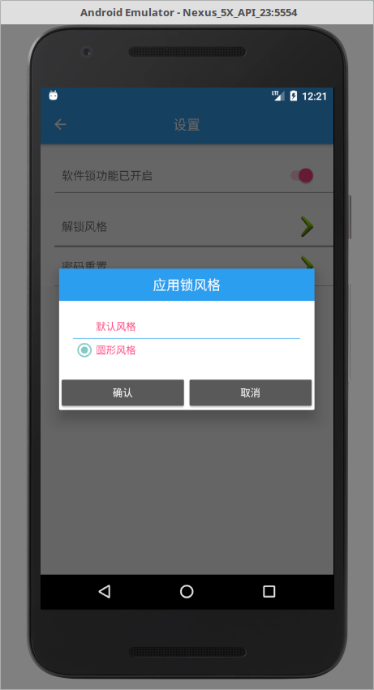
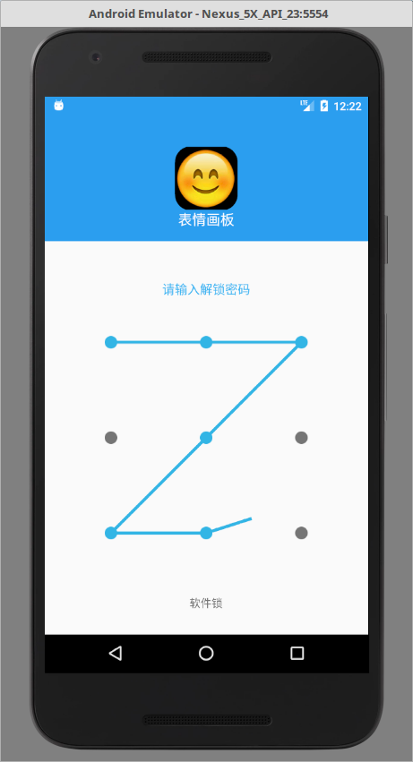
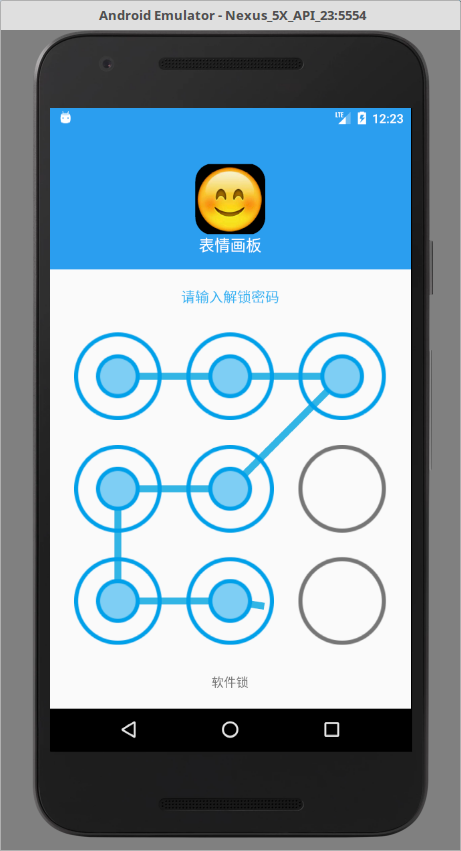

# SJAppLock 九宫格锁
九宫格锁先把用户需要加锁的应用的包名记录在sqlite数据库中。

使用服务来实现加锁功能，如果用户开启了应用锁功能，九宫格锁就会开启服务。如果用户打开已加锁应用，就会弹出一个输入九宫格密码的界面，输入正确才可以进入应用。

使用MaterialDesign设计风格，使用浮动按钮、可折叠标题栏、卡片式布局等，又使用清新蓝色作为主题颜色。

应用使用Firebase实时数据库功能，用户第一次打开应用时会收到一条欢迎的通知，通知的信息内容是保存在firebase数据库上的，所以可以随时修改。

# 《九宫格锁》
代码阅读对象：Android 开发者，望项目代码对您有利参考。

表情画板，使用画笔完成基本画画，最后保存到存储卡。需要读取存储卡的权限才能保存图片。

<a href="http://android.myapp.com/myapp/detail.htm?apkName=cn.studyjams.s2.sj0194.applock&apkCode=5">应用宝下载apk包</a>

## 免责声明
项目由“极客开发者”（jkdev.cn）编写，源代码开放并共享。

## APP部分截图：
<p>





</p>

## 1. 代码下载

1.使用git管理工具下载

```markdown
git clone https://github.com/kotlindev/AppLocker.git
```
2.直接下载：<br>
在github上找到下载按钮直接下载zip包即可<br>

3.使用Android Studio倒入即可

## 2. 联系开发者：
(1)邮箱：i@panhongyuan.com<br>
(2)微信订阅：极客开发者up<br>

